# PetCare Hub

## Overview

PetCare Hub is pet management app designed to help pet owners organize and manage their pet’s care. The app will allow users to find nearby veterinarians, schedule appointments, and store important medical history.

### Problem

Finding reliable veterinarian services, keeping track of their pets' medical data, and arranging vet visits are all challenges faced by pet owners. This may lead to a poor overall pet health care, missing appointments, and forgotten immunizations. These issues are addressed by PetCare Hub, which provides a single platform for all pet care needs.

### User Profile

The primary users of PetCare Hub are pet owners who want a convenient way to manage their pet’s health. 

### Features

- **User Registration and Login**: Users can create accounts and log in to access their pet care information.
- **Pet Profiles**: Users can create and manage profiles for each of their pets.
- **Find Vets**: Search for nearby veterinarians using the Google Maps and Places APIs.
- **Schedule Appointments**: Users can schedule and manage vet appointments using the Google Calendar API.
- **Medical Records**: Store and access medical records for each pet.

## Implementation

### Tech Stack

- **Frontend**: React, Sass, React Router, Axios
- **Backend**: Node.js, Express, Knex
- **Database**: MySQL 
- **APIs**: Google Maps API, Google Places API, Google Calendar API
- **Authentication**: Firebase Authentication

### APIs

- **Google Maps API**: To locate nearby veterinary clinics.
- **Google Places API**: To get details about veterinary clinics.
- **Google Calendar API**: To schedule and manage appointments.

### Sitemap

- **Home**: Introduction to the app and user login/registration.
- **Landing Page**: Overview of pets and upcoming appointments.
- **Find Vets**: Map and list of nearby veterinarians with option to add appointment.
- **Pet Profiles**: Pet details with option to add medical details.
- **Appointments/Reminders**: Calendar view of scheduled appointments with option to add reminders.
- **Pet List**: List of user's pets with option to add pets to your account.

### Mockups

#### Home Page
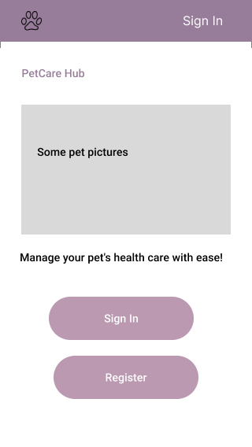

#### Register Page
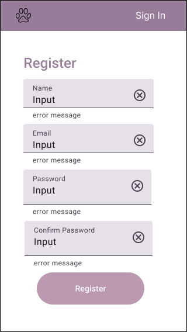

#### Login Page
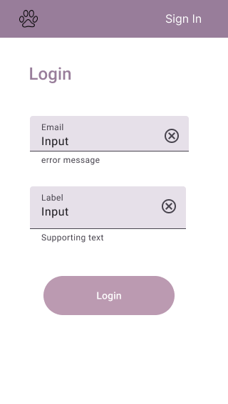

#### Landing Page
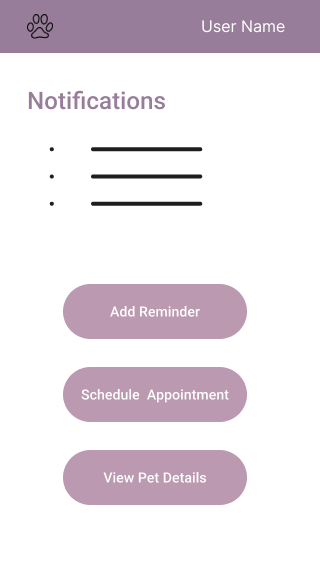

#### Calendar Page


#### Add Reminder Modal
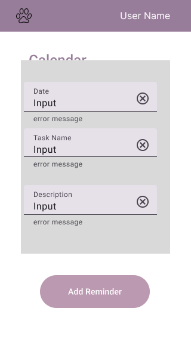

#### Find Vet Page
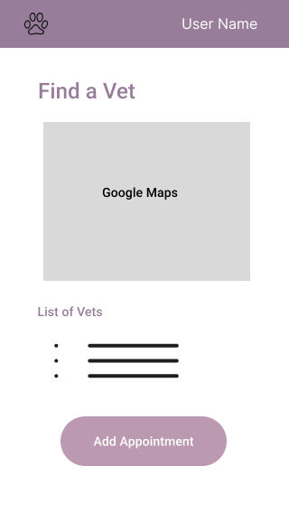

#### Schedule Appointment
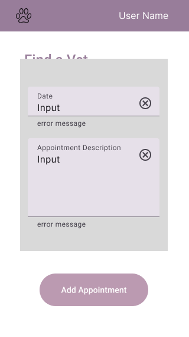

#### View Appointment Page
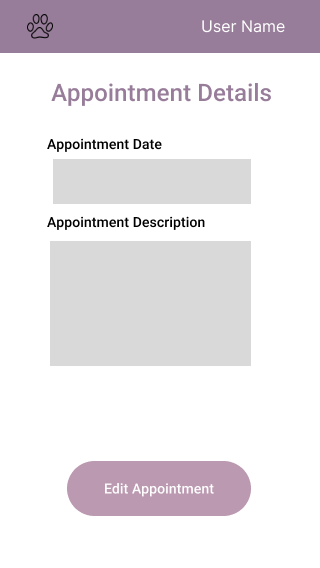

#### Pet List Page
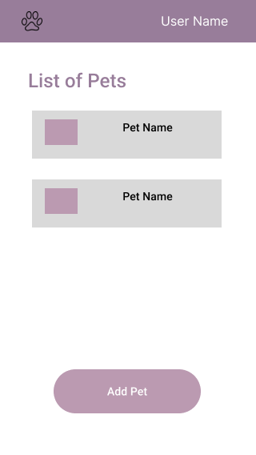

#### Pet Details Page
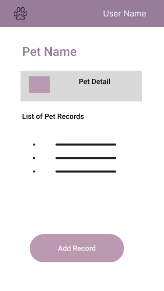

#### Add Record Page
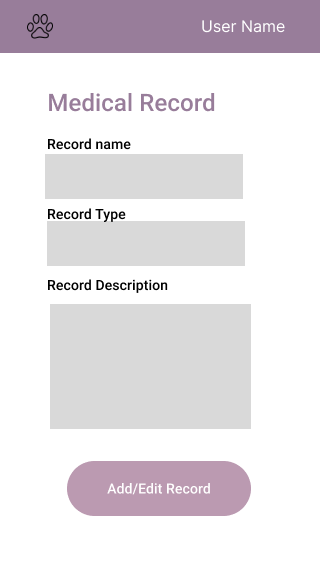


### Data
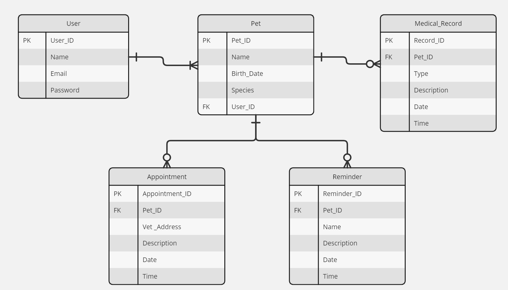

### Endpoints

- **User Registration**: `POST /api/register`
  - Parameters: name, email, password
  - Response: User object or error message

```
{
  "id": 1,
  "name": "Jane Doe",
  "email": "jane@gmail.com",
}
```

- **User Login**: `POST /api/login`
  - Parameters: email, password
  - Response: JWT token or error message

```
{
    "token": "seyJhbGciOiJIUzI1NiIsInR5cCI6IkpXVCJ9.eyJzdWIiOiIxMjM0NTY3ODkwIiwibmFtZSI6I..."
}
```

- **Get Pets**: `GET /api/pets`
  - Parameters: user_id
  - Response: List of pets or error message

```
[
    {
        "id": 1,
        "name": "Benji",
        "birth_date": "2015-07-17" ,
        "species": "dog"
    },
    ...
]
```

- **Add Pet**: `POST /api/pets`
  - Parameters: user_id, name, birth_date, species,
  - Response: Pet object or error message

```
{
    "id": 1,
    "name": "Benji",
    "birth_date": "2015-06-17" ,
    "species": "dog",
    "user_id": 1
}

```

- **Get Appointments**: `GET /api/appointments`
  - Parameters: pet_id
  - Response: List of appointments or error message

```
[
    {
        "id": 1,
        "date": "2025-07-17",
        "time": "10:00" ,
        "vet_address": "123 street st, city, country",
	"description": "example"
    },
    ...
]
```

- **Schedule Appointment**: `POST /api/appointments`
  - Parameters: pet_id, date, time, vet_address, description
  - Response: Appointment object or error message

```
{
    "id": 1,
    "date": "2015-06-17" ,
    "time": "10:00" ,
    "vet_address": "123 street st, city, country",
    "description": "example"
}

```

- **Get Reminders**: `GET /api/reminders`
  - Parameters: pet_id
  - Response: List of reminders or error message

```
[
    {
        "id": 1,
        "date": "2025-07-17",
        "time": "10:00" ,
        "task_name": "bath",
	"description": "use medicated shampoo"
    },
    ...
]
```

- **Schedule Reminder**: `POST /api/reminders`
  - Parameters: pet_id, date, time, task_name, description
  - Response: Appointment object or error message

```
{
    "pet_id": 1,
    "date": "2015-06-17",
    "time": "10:00" ,
    "task_name": "123 street st, city, country",
    "description": "example"
}

```

- **Get Medical Records**: `GET /api/records`
  - Parameters: pet_id
  - Response: List of medical records or error message

```
[
    {
        "id": 1,
        "date": "2025-07-17",
        "time": "10:00" ,
        "record_type": "vaccination",
	"description": "rabies"
    },
    ...
]
```

- **Add Medical Records**: `POST /api/records`
  - Parameters: pet_id, date, time, record_type, description
  - Response: Appointment object or error message

```
{
    "pet_id": 1,
    "date": "2015-06-17" ,
    "time": "10:00" ,
    "record_type": "vaccination",
    "description": "rabies"
}

```

### Auth

Firebase Authentication will be used for user authentication. 

## Roadmap

### Set-up database
- Create MySQL database migration and seed files
- Add all API calls.

### Set-up user login
- Set up the React project and Firebase Authentication.
- Create home, login, register page.

### Set up pet detail
- Create pet list, add pet and view pet details pages.
- Create add medical record page.
- Create landing page.

### Set up appointment/reminder pages
- Integrate Google Calendar API for scheduling appointments.
- Create add reminder modal and reminder page.

### Set up find vets pages
- Create find vet and add appointment pages.
- Integrate Google Maps and Places APIs for finding vets.
- Display vet search results.

### Test and Deploy 
- Test the application.
- Fix any bugs and update an UI changes.

## Nice-to-haves
- **Find groomers**: Search for nearby pet groomers using the Google Maps and Places APIs.
- **Medical records**: Uploads images/documents for medical records.
- **Edit user details**: Users can update passwords and personal information.
- **Edit pet details**: Users can update/delete pet records.
- **Edit calendar**: Remove or edit appointment/tasks.
- **Search records**: Users can search through pet medical records.